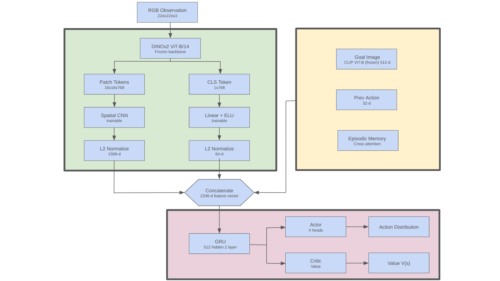

# See2Seek

Zero-shot embodied navigation in RoboTHOR using frozen DINOv2 + CLIP encoders with a recurrent PPO policy augmented by episodic spatial memory. The agent navigates toward image goals (ImageNav) and transfers zero-shot to object goals via language (ObjectNav).

We compare DINOv2's spatial patch features against CLIP's contrastive features as the observation encoder, demonstrating that DINOv2's self-supervised spatial representations combined with episodic memory attention are better suited for multi-room embodied navigation tasks.

## Architecture



### DINOv2 + Episodic Memory (Ours)

| Branch | Source | Trainable | Output Dim |
|--------|--------|-----------|------------|
| Spatial | DINOv2 patches (256x768) -> 2-layer CNN | Yes | 1568 |
| CLS | DINOv2 CLS token (768) -> Linear/LN/ELU | Yes | 64 |
| Goal | CLIP ViT-B/32 embedding (512) -> Linear/LN/ELU | Yes | 512 |
| Episodic Memory | Cross-attention over last 64 CLS tokens + poses | Yes | 128 |
| Prev Action | Learned embedding of last action | Yes | 32 |
| PointGoal | [geodesic_dist, cos, sin] -> Linear+ReLU | Yes | 32 |
| Ego-Pose | [x, y, cos_theta, sin_theta] -> Linear+ReLU | Yes | 32 |
| **Total GRU input** | | | **2368** |

**Recurrent core:** 2-layer GRU (512 hidden per layer)
- Layer 1: perception fusion (compresses 2368 -> 512)
- Layer 2: temporal reasoning and planning

### Episodic Memory Module

```
  CLS token at step t (768-d)
         |
         v
  +--------------------------------+
  | Cross-Attention                |
  |   Query: current CLS          |
  |   Keys/Values: last 64 CLS    |
  |   (circular buffer, detached) |
  +--------------------------------+
         |
         v
  Output projection -> (128-d) "have I been here before?" signal
```

The memory buffer resets at episode boundaries. Stored tokens are detached (no BPTT through time) — only the Q/K/V projections and output projection are trainable. This gives the agent a loop-detection signal without explicit map construction.

### CLIP Baseline

| Branch | Source | Trainable | Output Dim |
|--------|--------|-----------|------------|
| Observation | CLIP ViT-B/32 CLS token (512) -> projection | Yes | 512 |
| Goal | CLIP ViT-B/32 image/text embedding | No (frozen) | 512 |
| Prev Action | Learned embedding of last action | Yes | 32 |
| PointGoal | [geodesic_dist, cos(angle), sin(angle)] -> Linear+ReLU | Yes | 32 |
| **Total** | | | **1088** |

### PointGoal Sensor (GPS+Compass)

```
  Agent Position + Rotation (from simulator)
  Goal Position (from episode metadata)
            |
            v
  +----------------------------+
  | Compute:                   |
  |  - Geodesic distance       |
  |  - Relative angle to goal  |
  +----------------------------+
            |
            v
  [ geodesic_dist, cos(angle), sin(angle) ]   -->  Linear(3, 32) + ReLU  -->  (32-d)
```

Used during **ImageNav training/eval** (goal location known). Dropped 50% of training time for zero-shot transfer. For **ObjectNav** testing, zeroed out entirely — the GRU retains learned navigation behaviors from training.

### Ego-Pose Sensor (Dead-Reckoned Position)

```
  Actions executed since episode start
            |
            v
  +----------------------------+
  | Dead-reckon pose:          |
  |  - x, y relative to start  |
  |  - cos(theta), sin(theta)  |
  |    (agent heading)         |
  +----------------------------+
            |
            v
  [ x, y, cos(theta), sin(theta) ]   -->  Linear(4, 32) + ReLU  -->  (32-d)
```

Provides explicit spatial awareness of the agent's position relative to episode start. Combined with episodic memory, enables loop detection and room escape behavior without depth sensors or explicit mapping. The pose is accumulated from discrete actions (MoveAhead: x += 0.25*sin(θ), y += 0.25*cos(θ); Rotate: update θ by ±30°).

## Reward Function


```
  r_t = r_success + r_angle_success - Δd_tg - Δa_tg + r_slack
```

```
  +--------------------------------------------------+
  |               Per-Step Reward                     |
  +--------------------------------------------------+
  |                                                  |
  |  r_t = geodesic_scale * Δd_tg                    |
  |       + angle_scale * Δa_tg  (only if < 1m)     |
  |       + slack_reward                             |
  |       + (collision_penalty if collided)           |
  |       + (rotation_penalty if rotated)             |
  |                                                  |
  +--------------------------------------------------+

  +--------------------------------------------------+
  |             Terminal: Stop Action                  |
  +--------------------------------------------------+
  |                                                  |
  |  if dist < 1.0m:                                 |
  |      reward = +10.0  (success!)                  |
  |      if heading_diff < 25°:                      |
  |          reward += 5.0  (angle-success bonus)    |
  |  else:                                           |
  |      reward = shaped_penalty(dist)               |
  |                                                  |
  +--------------------------------------------------+
```

The angle-to-goal shaping (Δa_tg) is only active when the agent is within 1m of the goal position. This encourages the agent to first navigate to the goal, then orient to match the goal image viewpoint before calling Stop — matching the requirements for downstream ObjectNav transfer.

### Reward Parameters

| Parameter | Value | Purpose |
|-----------|-------|---------|
| `geodesic_reward_scale` | 2.0 | Reward for reducing shortest-path distance to goal |
| `angle_reward_scale` | 1.0 | Reward for reducing angle-to-goal heading (only within 1m) |
| `slack_reward` | -0.01 | Per-step cost (encourages efficiency) |
| `collision_penalty` | -0.01 | Discourages walking into walls |
| `rotation_penalty` | -0.005 | Fixed cost per rotation (prevents spinning) |
| `success_reward` | +10.0 | Large bonus for stopping within 1m of goal |
| `angle_success_reward` | +5.0 | Bonus for stopping within 1m AND facing goal heading (±25°) |
| `failed_stop_penalty` | -1.0 | Max penalty for stopping too far (shaped by distance) |
| `min_steps_before_stop` | 20 | Stop action masked for first 20 steps |

The asymmetric terminal rewards ensure that exploration is always preferred over premature stopping — even at low success rates, the expected value of exploring dominates early termination.

## Training

```bash
# Train with DINOv2 obs encoder (default)
python scripts/train.py --obs_encoder dino

# Train with CLIP obs encoder (baseline)
python scripts/train.py --obs_encoder clip

# Resume from checkpoint
python scripts/train.py --resume data_dino_v3/checkpoints/checkpoint_000000051200.pth

# Debug mode (2 envs, 2 updates, no W&B)
python scripts/train.py --debug
```

### Training Configuration

- **Environments:** 16 parallel RoboTHOR workers (shared-memory VecEnv)
- **Rollout:** 128 steps/env = 2048 steps per PPO update
- **PPO:** 4 epochs, 2 mini-batches, clip=0.2, entropy_coef=0.03
- **Optimizer:** Adam, lr=2.5e-4
- **Total steps:** 10M
- **GRU:** 2-layer, 512 hidden units
- **Episodic memory:** 64-slot circular buffer, single-head cross-attention
- **PointGoal dropout:** 50% (for zero-shot ObjectNav transfer)

## Evaluation

```bash
# ImageNav evaluation (with GPS)
python scripts/eval.py --checkpoint data_dino_v3/checkpoints/checkpoint_final.pth --task imagenav

# ImageNav evaluation (visual-only, no GPS)
python scripts/eval.py --checkpoint data_dino_v3/checkpoints/checkpoint_final.pth --task imagenav --zero_pointgoal

# Zero-shot ObjectNav (text goal, no GPS)
python scripts/eval.py --checkpoint data_dino_v3/checkpoints/checkpoint_final.pth --task objectnav

# Evaluate CLIP baseline model
python scripts/eval.py --checkpoint data_dino_v3/checkpoints/clip_checkpoint.pth --obs_encoder clip --task imagenav
```

### Metrics

- **SR (Success Rate):** Fraction of episodes where agent stops within 1m of goal
- **SPL (Success weighted by Path Length):** SR penalized by path inefficiency


## Project Structure

```
See2Seek/
├── scripts/
│   ├── train.py              # Training entry point
│   ├── eval.py               # Evaluation entry point
│   └── plot_training.py      # Training curve visualization
├── see2seek/
│   ├── agents/
│   │   └── gru_policy.py     # 2-layer GRU Actor-Critic + Episodic Memory + SpatialCompressionHead
│   ├── buffers/
│   │   └── rollout_buffer.py # Recurrent PPO rollout storage (multi-layer hidden)
│   ├── envs/
│   │   ├── robothor_env.py   # RoboTHOR gym wrapper + reward logic
│   │   └── vec_env.py        # Shared-memory vectorized environments
│   ├── models/encoders/
│   │   ├── dino_encoder.py   # Frozen DINOv2 ViT-B/14
│   │   └── clip_encoder.py   # Frozen CLIP ViT-B/32
│   ├── trainers/
│   │   └── ppo_trainer.py    # PPO training loop (with memory propagation)
│   ├── evaluation/
│   │   └── evaluator.py      # Parallel evaluation loop
│   └── utils/
│       ├── config.py         # Central configuration
│       └── augment_goal_angles.py  # Multi-angle goal augmentation (optional preprocessing)
├── configs/
│   └── train_robothor.yaml   # YAML config overrides
├── dataset/                  # Primary dataset (train/val/debug splits)
│   ├── train/
│   │   ├── episodes/         # 120 episode JSON files
│   │   └── embeddings.pt     # Pre-cached CLIP goal embeddings
│   └── val/
│       ├── episodes/         # 15 episode JSON files
│       └── embeddings.pt
└── data_dino_v3/             # Training outputs (checkpoints, logs)
    ├── checkpoints/
    ├── logs/
    └── goal_datasets/
```

## Key Design Decisions

1. **Frozen encoders, trainable fusion:** DINOv2 and CLIP never update — only the spatial CNN, CLS projection, goal projection, episodic memory, and GRU train. This keeps compute low and leverages pretrained representations.

2. **Episodic memory for loop detection:** Instead of explicit mapping, the agent uses attention over past CLS tokens to detect revisited locations. This lightweight mechanism enables multi-room navigation without constructing a spatial map.

3. **Trainable goal projection:** The CLIP goal embedding passes through a learned Linear/LN/ELU layer (512->512) so the model can shape goal representations for navigation rather than relying on the GRU to implicitly project.

4. **2-layer GRU:** Hierarchical temporal processing — layer 1 fuses multimodal perception, layer 2 handles planning and temporal reasoning over longer horizons.

5. **Asymmetric terminal rewards:** Success (+10.0) vs failed stop (-2.0) ensures the expected value of exploration dominates premature stopping, even at low success rates. Prevents degenerate "wait-then-stop" policies.

6. **Raw token storage in buffer:** The rollout buffer stores raw DINOv2 outputs (not compressed features) so gradients flow through trainable heads during PPO updates.

7. **L2-normalized branches:** Spatial, CLS, and Goal branches are all L2-normalized to unit norm before concatenation, ensuring no branch dominates by magnitude alone.

8. **PointGoal as training signal with 50% dropout:** GPS+Compass sensor teaches the GRU *how to navigate* during ImageNav; learned behaviors transfer to ObjectNav at test time where PointGoal is unavailable.

## References

- [ZSON: Zero-Shot Object-Goal Navigation](https://arxiv.org/abs/2206.12403)
- [EmbCLIP: Simple but Effective CLIP Embeddings for Embodied AI](https://arxiv.org/abs/2111.09888)
- [DINOv2: Learning Robust Visual Features](https://arxiv.org/abs/2304.07193)
- [CLIP: Learning Transferable Visual Models From Natural Language Supervision](https://arxiv.org/abs/2103.00020)
- [RoboTHOR: An Open Simulation-to-Real Embodied AI Platform](https://arxiv.org/abs/2004.06799)
