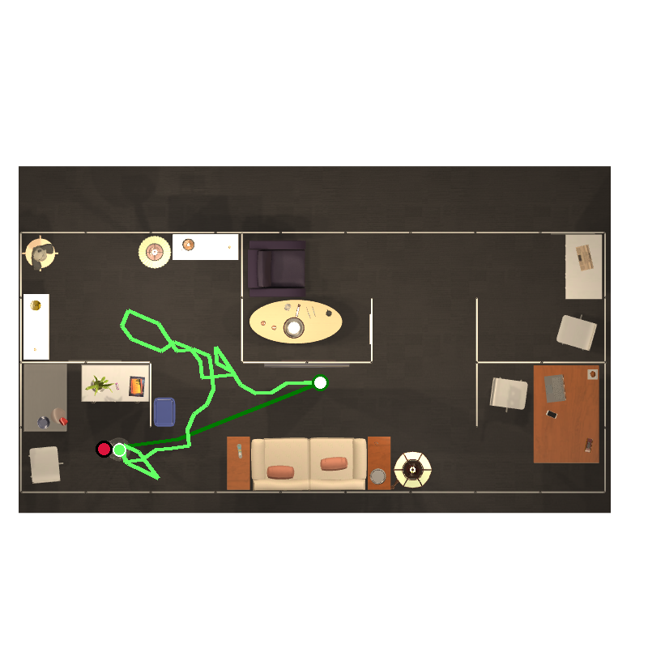
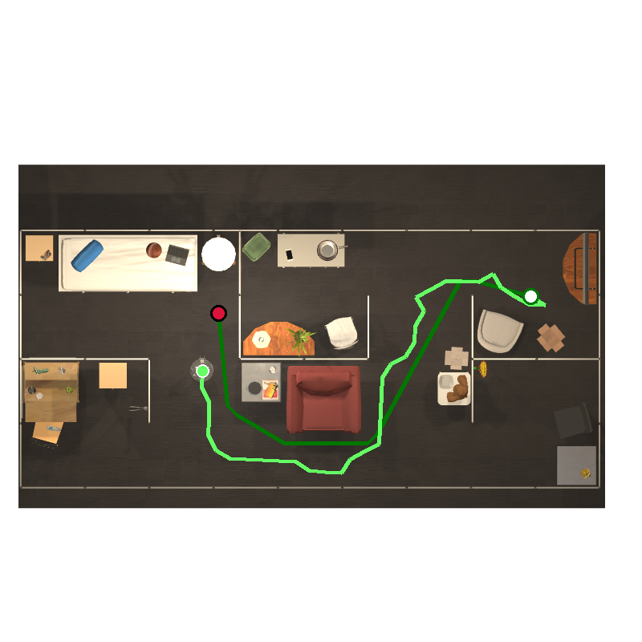
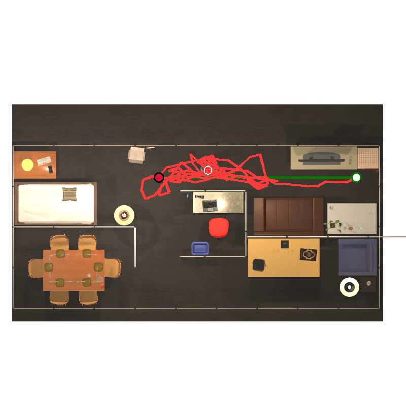
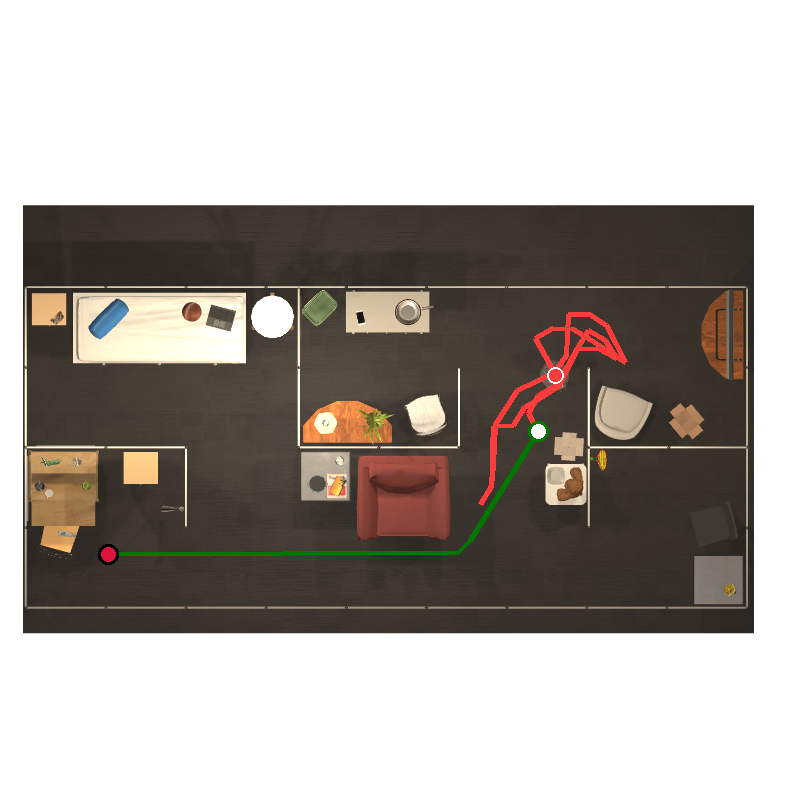
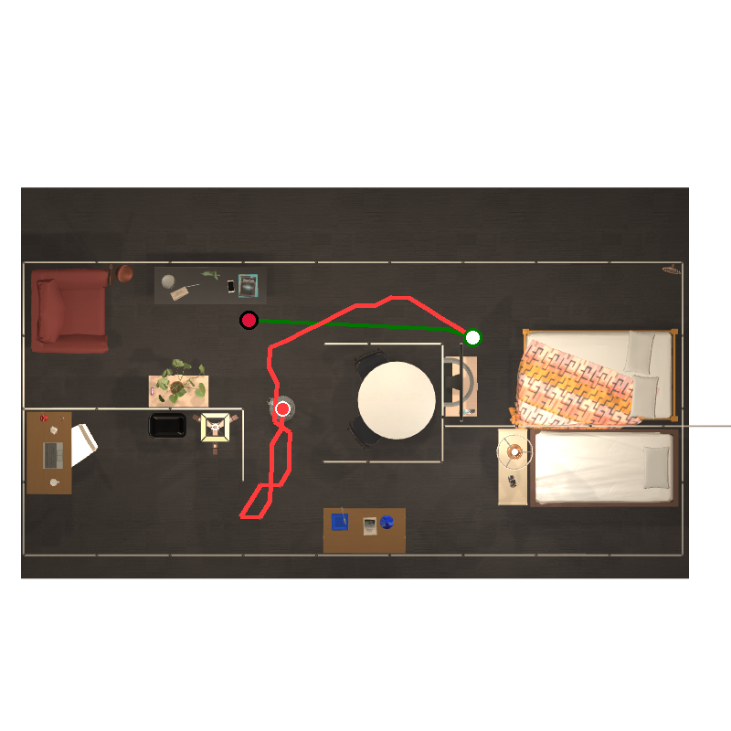
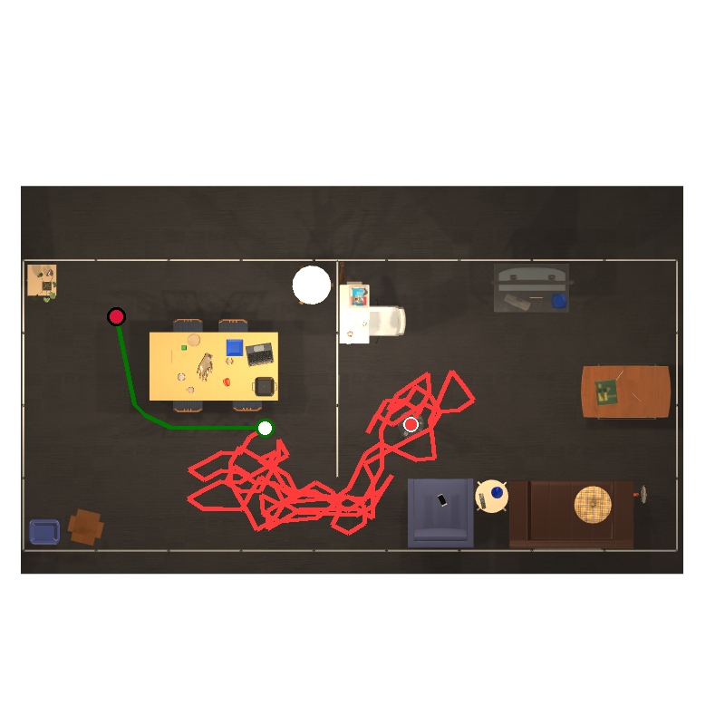
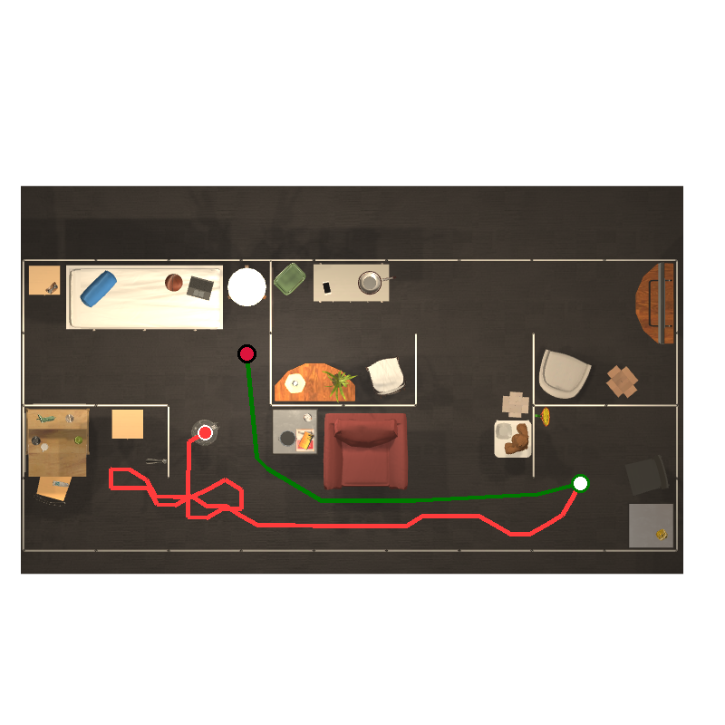
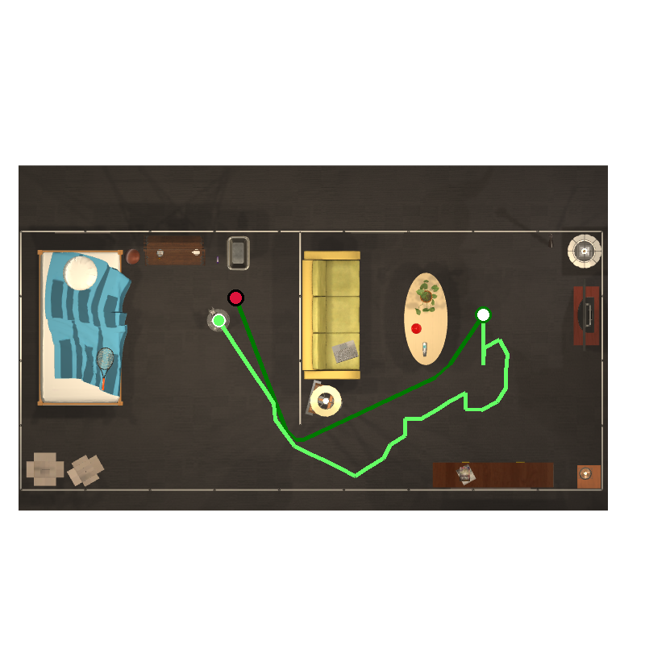

# See2Seek

Zero-shot embodied navigation in RoboTHOR using frozen DINOv2 + CLIP encoders with a recurrent PPO policy and episodic spatial memory. Trained on ImageNav (image goals), transfers zero-shot to ObjectNav (object category goals via CLIP text encoding).

## Architecture


| Branch | Source | Output Dim |
|--------|--------|------------|
| Spatial | DINOv2 patches (256x768) -> 2-layer CNN | 1568 |
| CLS | DINOv2 CLS token -> Linear/LN/ELU | 64 |
| Goal | CLIP ViT-B/32 embedding -> Linear/LN/ELU | 512 |
| Episodic Memory | Cross-attention over last 128 CLS tokens + poses | 128 |
| Prev Action | Learned embedding | 32 |
| Ego-Pose | Dead-reckoned [x, y, cos(theta), sin(theta)] -> Linear+ReLU | 32 |
| **GRU input** | | **2336** |

**Recurrent core:** 2-layer GRU (512 hidden). Layer 1 fuses multimodal perception, layer 2 handles temporal reasoning and planning.

**Episodic memory:** 128-slot rolling buffer of past CLS tokens with pose-conditioned cross-attention. Resets at episode boundaries. Stored tokens are detached (no BPTT through time). Gives the agent a "have I been here before?" signal without explicit map construction.

**Ego-pose:** Dead-reckoned from discrete actions, only updated on successful moves (collision-aware). Combined with episodic memory, enables loop detection and room escape.

All encoders (DINOv2 ViT-B/14, CLIP ViT-B/32) are frozen. Only the spatial CNN, projections, memory module, and GRU are trainable.

## Trajectory Examples

| | |
|:---:|:---:|
|  Bowl |  Laptop |
|  SprayBottle |  Mug |
|  HousePlant |  BasketBall |
|  Laptop |  Bowl |

Green paths = successful trials, red = failed. Light green = oracle shortest path. White circle with green boundary = start, red circle with black boundary = goal, green circle with white boundary = agent stop position when succeed, red circle with white boundary = agent stop when failed.

## Evaluation Results

Trained for 10M steps. Difficulty defined by oracle shortest path: easy (<=3m), medium (3-6m), hard (>6m).

### ImageNav

| Difficulty | Episodes | SR (%) | SPL |
|-----------|----------|--------|-----|
| **Overall** | **1740** | **15.4** | **0.094** |
| Easy (<=3m) | 861 | 23.1 | 0.126 |
| Medium (3-6m) | 633 | 8.7 | 0.071 |
| Hard (>6m) | 246 | 5.7 | 0.042 |

### ObjectNav (Zero-Shot)

| Difficulty | Episodes | SR (%) | SPL |
|-----------|----------|--------|-----|
| **Overall** | **1740** | **17.0** | **0.108** |
| Easy (<=3m) | 836 | 27.4 | 0.159 |
| Medium (3-6m) | 649 | 8.2 | 0.069 |
| Hard (>6m) | 255 | 5.1 | 0.040 |

**Note:** ObjectNav's higher overall SR (17.0% vs 15.4%) is driven almost entirely by easy episodes (27.4% SR). On medium and hard episodes, ObjectNav performs worse than ImageNav (8.2%/5.1% vs 8.7%/5.7%), indicating the agent exploits short-distance episodes where CLIP text-to-vision alignment happens to work well, but struggles with longer-distance navigation that requires sustained goal-directed behavior.

## Reward Function

| Parameter | Value | Purpose |
|-----------|-------|---------|
| `success_reward` | +10.0 | Stopping within 1m of goal |
| `angle_success_reward` | +5.0 | Stopping within 1m AND facing goal heading (±25°) |
| `failed_stop_penalty` | -0.5 | Stopping far from goal (shaped by distance) |
| `timeout_penalty` | -2.0 | Episode times out without stopping |
| `geodesic_reward_scale` | 1.5 | Reward for reducing shortest-path distance |
| `slack_reward` | -0.005 | Per-step cost |
| `exploration_bonus` | 0.10 | Intrinsic reward for new grid cell visits, decays to a 0.015 floor over 10M steps |
| `collision_penalty` | -0.01 | Walking into walls |
| `rotation_penalty` | -0.002 | Per-rotation cost to prevent spinning |

Angle-to-goal shaping is only active within 1m of the goal, encouraging the agent to orient before calling Stop.

## Training

```bash
# Train (DINOv2 obs encoder)
python scripts/train.py

# Resume from checkpoint
python scripts/train.py --resume data_dino_v7/checkpoints/checkpoint_000010000000.pth

# Debug mode (2 envs, 2 updates, no W&B)
python scripts/train.py --debug
```

### Ego-pose and episodic-memory ablations

```bash
# Drop only the direct ego-pose input; memory still uses pose.
python scripts/train.py --no-egopose

# Drop episodic attention and its GRU input; retain direct ego-pose.
python scripts/train.py --no-episodic-memory

# Drop both branches.
python scripts/train.py --no-egopose --no-episodic-memory
```

Each command still prompts for the output folder. Choose a separate folder for
each ablation. The equivalent YAML settings are `encoder.use_egopose: false`
and `encoder.use_episodic_memory: false`.

| DINOv2 variant (PointGoal off) | GRU input dimension |
|---|---:|
| Full model | 2336 |
| No direct ego-pose | 2304 |
| No episodic memory | 2208 |
| Neither branch | 2176 |

Disabled branches are removed from the model and GRU input. The no-memory
variant has no attention parameters, memory buffers, or replay memory snapshots;
the GRU remains recurrent. `--no-egopose` removes the direct 32-dimensional branch
only, leaving pose conditioning inside memory when memory is enabled.

These variants change parameter shapes, so start a fresh run for each ablation.
To resume an ablation, repeat its flags (or use the same YAML settings).
Evaluation and trajectory visualization restore the architecture from the saved
checkpoint automatically; no ablation flags are needed for those commands.

### Configuration

- 16 parallel RoboTHOR workers (shared-memory VecEnv with auto worker respawn)
- 128 steps/env = 2048 steps per PPO update
- PPO: 4 epochs, 2 mini-batches, clip=0.2, entropy_coef=0.05
- Adam lr=2.5e-4 with linear decay
- Curriculum: max_steps 150 -> 500 over 3M steps
- Exploration bonus: 0.10 per new cell, decays to a 0.015 floor over 10M steps

## Evaluation

```bash
# ImageNav evaluation
python scripts/eval.py --checkpoint data_dino_v7/checkpoints/checkpoint_final.pth --task imagenav

# Zero-shot ObjectNav (text goal, no GPS)
python scripts/eval.py --checkpoint data_dino_v7/checkpoints/checkpoint_final.pth --task objectnav
```

Evaluation logs per-episode path length and shortest path length, with a difficulty breakdown (easy <=3m, medium 3-6m, hard >6m).

### Metrics

- **SR (Success Rate):** Fraction of episodes where agent stops within 1m of goal
- **SPL (Success weighted by Path Length):** SR penalized by path inefficiency

## Visualization

```bash
# Single episode, 5 stochastic trials overlaid on AI2-THOR top-down view
python scripts/visualize_trajectory.py \
    --checkpoint data_dino_v7/checkpoints/checkpoint_final.pth \
    --episodes FloorPlan_Val3_2_Apple_6 \
    --episodes_path /path/to/val/episodes \
    --scene_dataset_path /path/to/val

# ObjectNav visualization
python scripts/visualize_trajectory.py \
    --checkpoint data_dino_v7/checkpoints/checkpoint_final.pth \
    --task objectnav --use_list \
    --episodes_path /path/to/val/episodes \
    --scene_dataset_path /path/to/val
```

## Project Structure

```
See2Seek/
├── scripts/
│   ├── train.py                # Training entry point
│   ├── eval.py                 # Evaluation entry point
│   ├── visualize_trajectory.py # Bird's-eye trajectory visualization
│   ├── plot_training.py        # Training curve plots
│   └── plot_evaluation.py      # Evaluation result plots
├── see2seek/
│   ├── agents/
│   │   └── gru_policy.py       # 2-layer GRU Actor-Critic + Episodic Memory
│   ├── buffers/
│   │   └── rollout_buffer.py   # Recurrent PPO rollout storage
│   ├── envs/
│   │   ├── robothor_env.py     # RoboTHOR wrapper + reward logic
│   │   └── vec_env.py          # Shared-memory VecEnv with worker respawn
│   ├── models/encoders/
│   │   ├── dino_encoder.py     # Frozen DINOv2 ViT-B/14
│   │   └── clip_encoder.py     # Frozen CLIP ViT-B/32
│   ├── trainers/
│   │   └── ppo_trainer.py      # PPO training loop
│   ├── evaluation/
│   │   └── evaluator.py        # Parallel evaluation loop
│   └── utils/
│       └── config.py           # Central configuration
├── docs/                       # Architecture diagram + trajectory images
├── configs/                    # YAML config overrides
├── requirements.txt
└── setup.py
```

## References

- [ZSON: Zero-Shot Object-Goal Navigation](https://arxiv.org/abs/2206.12403)
- [EmbCLIP: Simple but Effective CLIP Embeddings for Embodied AI](https://arxiv.org/abs/2111.09888)
- [DINOv2: Learning Robust Visual Features](https://arxiv.org/abs/2304.07193)
- [CLIP: Learning Transferable Visual Models From Natural Language Supervision](https://arxiv.org/abs/2103.00020)
- [RoboTHOR: An Open Simulation-to-Real Embodied AI Platform](https://arxiv.org/abs/2004.06799)
